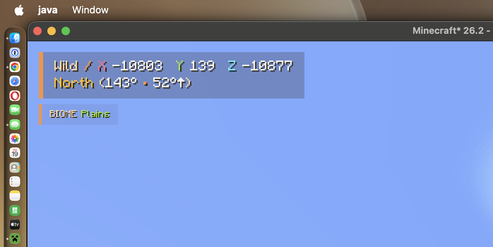
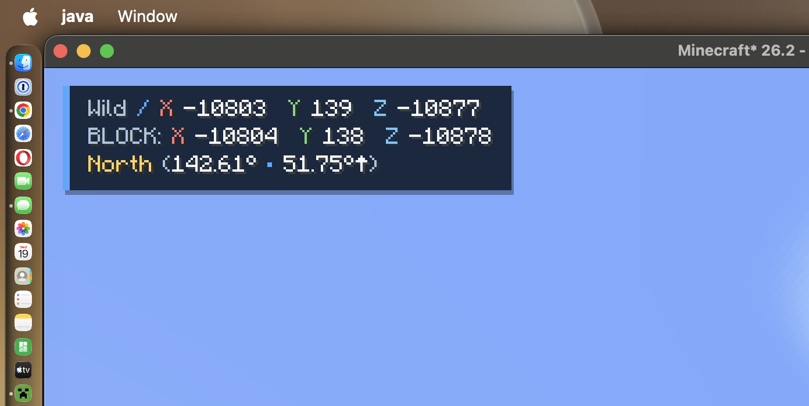
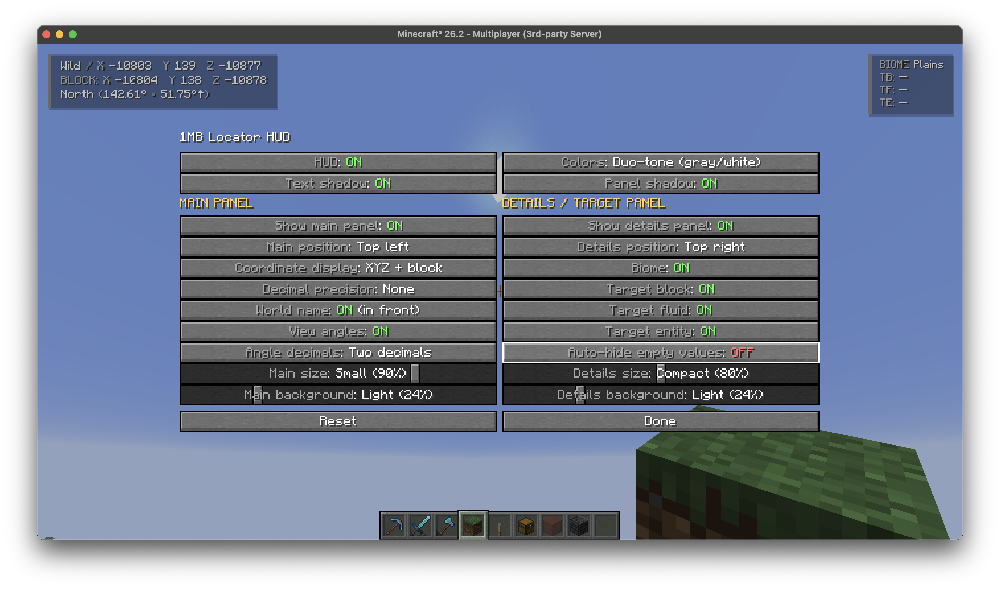

# 1MB Locator HUD

1MB Locator HUD is a client-only Fabric mod for Minecraft Java Edition 26.2. It replaces coordinate-heavy F3 use with compact, configurable main and details panels. It sends no network messages, requires no server plugin or permission, and works in singleplayer and multiplayer.

The mod was made for [1MoreBlock.com](https://www.1moreblock.com/), a public Java Edition survival Minecraft server currently running Minecraft 26.2. It remains fully server-independent and can be used on any compatible server or in singleplayer.


## Release status

- **Current release:** [1MB Locator HUD 1.47.0 — Snapshot Public Beta 4](https://github.com/mrfdev/1MB-Locator-HUD/releases/tag/v1.47.0), published as a prerelease that **requires testing**.
- **Previous beta:** [1MB Locator HUD 1.40.0 — Snapshot Public Beta 3](https://github.com/mrfdev/1MB-Locator-HUD/releases/tag/v1.40.0).

The feature, configuration, installation, and build references below describe 1.47.0 Snapshot Public Beta 4. This build requires broader player testing before it should be treated as stable. Please report beta feedback and problems through the [issue tracker](https://github.com/mrfdev/1MB-Locator-HUD/issues).

## Features

- Rounded whole-number XYZ, one- or two-decimal XYZ, containing-block XYZ, both coordinate rows, or neither.
- Optional Overworld–Nether coordinate lens that shows the approximate mathematical X/Z counterpart without claiming that a portal exists or a destination is safe.
- Optional friendly world/dimension name before or after the first coordinate row. When coordinates are hidden, the world name uses its own row.
- Three-state view direction: the default four-way cardinal name, an opt-in eight-way name with a compact signed-axis hint, or off. Compact yaw/pitch angles remain independently toggleable in whole, one-decimal, or two-decimal degrees.
- Optional biome, three-second biome-transition, smoothed horizontal movement-speed, and crosshair-target block, fluid, and entity rows with Friendly or API-accurate names.
- Optional auto-hide keeps empty target rows compact, while 0.5-second target linger prevents flicker over block edges.
- Independently visible and positioned main and details panels. A live editor can drag either panel near any corner with small, recoverable X/Y offsets; an unmodified details panel stacks vertically when both panels share a corner.
- Independent five-stop size sliders at 60%, 70%, 80%, 90%, and 100% for each panel. A default-off Accessibility switch adds 110%, 125%, and 150% choices while retaining screen-edge clamping.
- Independent minimum- and maximum-width controls for each panel, defaulting to automatic content sizing with optional 120–320 GUI-pixel base widths and final screen-edge clamping.
- Independent seven-stop background sliders at `OFF`, 7%, 24%, 55%, 72%, 88%, and 100%. `OFF` uses a compact backgroundless layout.
- Shared text and panel shadows plus nine color schemes: None (all white), Duo-tone, Ocean, Amethyst, Emerald, Ember, Frost, Rose, and Gold.
- Optional default-off biome-aware colors, enabled by the nameless `aibo magic` checkbox beside Colors, smoothly switch among existing themes for underground, cold, warm, and temperate local environments without replacing the saved manual theme.
- Explicit coordinate copying in Plain, namespaced Vanilla TP, or CMI `tppos` format. The remappable `F8` action writes locally to the clipboard and never runs or sends the copied text.
- Automatically respects Minecraft's server-provided reduced-debug state: coordinate rows, the coordinate lens, coordinate copying, and target sampling/display are unavailable while the server restricts them. Direction, biome, and locally observed speed remain available.
- Four built-in, fully editable Minimal, Explorer, Builder, and Privacy presets, plus exactly one separate local Saved setup slot for preserving a preferred configuration.
- Remappable global visibility (`F7` by default), coordinate-copy (`F8` by default), and configuration-screen (unbound by default) key mappings, plus optional Mod Menu integration with responsive scrolling, wide two-column and narrow single-column layouts, near-white setting names, color-coded state labels, and one-second hover tooltips. Accessibility mode adds expanded keyboard/narrator guidance and explains why dependent controls are unavailable.
- Translation-backed configuration labels, option values, tooltips, confirmations, and key-binding text, with a complete English fallback and support for community locale files.
- Automatically saved, backward-compatible client configuration in `config/locator-hud.json`, with brief client-thread debouncing to avoid redundant disk writes during rapid changes.

## Requirements

- Minecraft Java Edition 26.2
- Java 25
- [Fabric Loader 0.19.3 or newer](https://fabricmc.net/)
- [Fabric API 0.154.2+26.2](https://modrinth.com/mod/fabric-api)
- [Mod Menu 20.0.1 or newer](https://modrinth.com/mod/modmenu) is optional but recommended

## Installing Snapshot Public Beta 4

1. Install Fabric Loader for Minecraft 26.2.
2. Download [Fabric API](https://modrinth.com/mod/fabric-api) and [`1MB-Locator-HUD-1.47.0.jar`](https://github.com/mrfdev/1MB-Locator-HUD/releases/download/v1.47.0/1MB-Locator-HUD-1.47.0.jar).
3. Put both JAR files in the client instance's `mods/` folder.
4. Optionally add [Mod Menu](https://modrinth.com/mod/modmenu) for the in-game configuration screen.
5. Launch Minecraft with the Fabric profile.

## Usage

Press `F7` in game to show or hide the entire HUD. Minecraft displays a short enabled/disabled confirmation, and the binding can be changed in the Controls screen under **Locator HUD**.

Press `F8` to copy your current coordinates using the configured **Copy format** and **Decimal precision**. The binding is remappable under **Locator HUD**. This action only updates the local clipboard and shows a confirmation; it never opens chat, runs the copied command, or sends it to the server. If the connected server enables reduced debug information, copying is refused and the existing clipboard is left unchanged.

To configure the mod without Mod Menu, assign **Open Locator HUD settings** in Minecraft's Controls screen under **Locator HUD**. It intentionally defaults to unbound to avoid conflicting with existing controls. The assigned key opens the same complete configuration screen from gameplay or another screen.

With Mod Menu installed, open **Mods**, select **1MB Locator HUD**, and use its configuration button. Changes preview immediately and save automatically after a brief pause; slider and panel drags save their final value on release, and **Done** flushes anything pending before returning to the previous screen. The **Setup** section can apply one of four built-in presets, save and restore exactly one preferred setup, or open **Place panels**. In that explicit editor, drag either outlined panel near a corner; hidden and empty panels receive labeled fallback handles. **Reset positions** restores only the default panel corners and offsets. The normal gameplay HUD never captures clicks. **Reset** requires confirmation before restoring all factory defaults and never deletes the separate Saved setup.

The top-level **Accessibility** switch defaults to `OFF`. Turning it on exposes 110%, 125%, and 150% panel sizes, adds fuller keyboard/narrator usage guidance, and gives explicit reasons when a dependent setting is unavailable. It does not force a color palette or background. Turning it off returns any panel above 100% to Normal (100%); sizes from 60% through 100% are preserved.

### Server-restricted debug information

Some servers enable Minecraft's built-in reduced-debug state. Locator HUD reads the supported state already maintained on the local player and responds to changes while connected. While the restriction is active:

- decimal and containing-block coordinate rows are hidden;
- the Overworld–Nether coordinate lens is hidden;
- `F8` coordinate copying is refused without changing the existing clipboard; and
- block, fluid, and entity target sampling stops, any lingered target values are cleared, and their rows are hidden.

World name, view direction, view angles, biome information, biome transitions, locally observed movement speed, and visual settings remain available. The restriction never rewrites the player's configured choices; those choices automatically take effect again when full debug information is available. Enforcement is automatic and has no client-side override. Locator HUD does not inspect packets or add custom networking to implement it.

Without Mod Menu, the HUD and all three key mappings still work normally; assign **Open Locator HUD settings** once to retain direct in-game configuration access. Configuration is stored in `config/locator-hud.json`; the optional Saved setup uses `config/locator-hud-saved-setup.json`. Close the client before editing either file manually.

Existing unversioned and schema-1 configurations are migrated automatically to schema 2. If the main configuration is malformed, the original is preserved as a dated `.broken.json` backup before safe defaults are written. A malformed Saved setup is backed up and left unavailable until a new setup is saved. If a required backup cannot be created—or either file belongs to a newer schema—the protected file is not overwritten; the main configuration uses defaults in memory, while a protected Saved setup remains unavailable.

## Configuration reference

| Area | Setting | Default | Choices or behavior |
| --- | --- | --- | --- |
| Global | HUD | `ON` | Shows or hides the entire HUD. |
| Global | Accessibility | `OFF` | Adds 110%, 125%, and 150% size choices plus expanded keyboard/narrator guidance and disabled-control explanations. It never forces Colors or Background. Turning it off returns sizes above 100% to Normal (100%). |
| Global | Colors | Ocean | None (all white), Duo-tone, Ocean, Amethyst, Emerald, Ember, Frost, Rose, or Gold; shared by both panels. |
| Global | Biome-aware colors | `OFF` | The nameless checkbox beside Colors has the tooltip `aibo magic`. When checked, it uses only the current local biome and column height to select an existing underground, cold, warm, or temperate theme. A short delay and gradual blend prevent border flicker. Unchecking it immediately restores the saved Colors choice. |
| Global | Text shadow | `ON` | Shared by both panels. |
| Global | Panel shadow | `ON` | Shared by both panels and available when at least one enabled panel uses a non-`OFF` background. |
| Global | Copy format | Plain | Plain produces `X … Y … Z … / World`; Vanilla TP produces `/minecraft:teleport @s …`; CMI `tppos` produces `/cmi tppos -p:<playername> … <world>`. All use Decimal precision. The command formats are copied templates only and require the relevant server command and permission. |
| Setup | Built-in preset | Minimal selected, not applied | Minimal, Explorer, Builder, or Privacy. Applying changes existing content, visibility, sizes, and backgrounds while retaining the manual Colors choice, biome-aware color override, panel positions and width limits, shadows, and Copy format. Every resulting setting remains editable. Privacy hides exact location rows in this HUD only; it does not mask F3 or other mods. |
| Setup | Saved setup | Empty until saved | **Save current setup** writes one separate local slot. Replacing it and restoring it require confirmation; restore replaces all current settings. |
| Setup | Place panels | Default corners, zero offsets | Opens an explicit live editor for dragging the main and details panels. The nearest corner is selected automatically, offsets snap within 6 GUI pixels and are limited to ±64, and **Reset positions** changes only placement. Normal gameplay remains non-interactive. |
| Setup | Reset | — | Requires confirmation before restoring factory defaults. It does not modify the Saved setup slot. |
| Main | Show main panel | `ON` | Independently shows or hides the main panel. |
| Main | Main position | Top / Left | Top / Left, Top / Right, Bottom / Left, or Bottom / Right. Choosing a corner here clears the main panel's fine offset; **Place panels** can add a small offset. |
| Main | Coordinate display | XYZ only | XYZ only, block XYZ only, XYZ plus block, or none. Coordinate rows are temporarily hidden when the server enables reduced debug information. |
| Main | Decimal precision | 1 decimal | `None` rounds XYZ to whole numbers; 1 or 2 decimal places are also available. This control is available when coordinate display includes XYZ or the coordinate lens is on. |
| Main | OW / Nether lens | `OFF` | In the vanilla Overworld, shows approximate corresponding Nether X/Z coordinates; in the vanilla Nether, shows approximate corresponding Overworld X/Z coordinates. Uses Decimal precision, does not locate portals or guarantee safety, and is hidden under server-provided reduced debug. |
| Main | World name | `ON (behind)` | `ON (in front)`, `ON (behind)`, or `OFF`. |
| Main | View direction | `ON` | `ON` shows the existing four-way cardinal name, `ON (with details)` adds eight-way directions and a compact signed-axis hint such as `Northeast [+X/-Z]`, and `OFF` hides it. |
| Main | View angles | `OFF` | Shows compact yaw and pitch values; when view direction is also enabled, they appear beside it. |
| Main | Angle decimals | `OFF` | Whole degrees when `OFF`, or 1 or 2 decimal places; available when view angles are on. |
| Main | Main size | Normal (100%) | Normally snaps to 60%, 70%, 80%, 90%, or 100%. Accessibility adds 110%, 125%, and 150%. |
| Main | Min / max width | Auto / Auto | Each bound can stay automatic or use 120, 160, 200, 240, 280, or 320 GUI pixels before Main size scaling. A crossing change moves the companion bound to the same value. Long values are shortened where needed, fixed labels retain a small intrinsic floor, and current screen space is always the final ceiling. |
| Main | Main background | Balanced (72%) | `OFF`, 7%, 24%, 55%, 72%, 88%, or 100%. |
| Details | Show details panel | `ON` | Independently enables the details/target panel. It does not render until at least one details row is visible. |
| Details | Details position | Top / Right | Top / Left, Top / Right, Bottom / Left, or Bottom / Right. Choosing a corner here clears the details panel's fine offset; **Place panels** can add a small offset. A zero-offset details panel automatically stacks when it shares the main panel's corner. |
| Details | Biome | `OFF` | Shows the biome at the player's current position. |
| Details | Biome change | `OFF` | Briefly shows `Previous → Current` for three seconds after the biome beneath the player changes. It uses only the current client-known biome and does not scan or retain discovery history. When the normal Biome row is enabled, the notice temporarily replaces its value. |
| Details | Movement speed | `OFF` | Shows locally observed horizontal movement in blocks per second, smoothed over half a second. It does not read or change CMI speed. |
| Details | Target block, fluid, and entity | All `OFF` | Three independent crosshair-target rows. Empty enabled rows show an em dash unless auto-hide is on. Target sampling and rows are disabled under server-provided reduced debug. |
| Details | Target names | API accurate | `API accurate` shows the full stable namespaced identifier, such as `minecraft:oak_log`. `Friendly` uses Minecraft's localized player-facing name, such as `Oak Log`, with the identifier as a safe fallback. |
| Details | Auto-hide empty values | `OFF` | Hides empty block, fluid, and entity rows; does not hide an enabled biome row. Target linger may delay hiding briefly. If no rows remain visible, the entire details panel does not render. |
| Details | Target linger | `OFF` | Keeps each last non-empty target value visible for 0.5 seconds after the crosshair moves away. |
| Details | Details size | Compact (80%) | Normally snaps to 60%, 70%, 80%, 90%, or 100%. Accessibility adds 110%, 125%, and 150%. |
| Details | Min / max width | Auto / Auto | Uses the same automatic or 120–320 GUI-pixel base widths, crossing-bound repair, value shortening, intrinsic label floor, and final screen-space ceiling as the main panel. |
| Details | Details background | `OFF (minimal)` | `OFF`, 7%, 24%, 55%, 72%, 88%, or 100%. |

## Localization

The complete English fallback is [`src/client/resources/assets/locatorhud/lang/en_us.json`](src/client/resources/assets/locatorhud/lang/en_us.json). Every configuration label, option choice, tooltip, confirmation, key-binding label, and local status message uses a translation key; environment-neutral option types store only those keys and never depend on Minecraft text components.

Community translations can be contributed as `src/client/resources/assets/locatorhud/lang/<locale>.json`, using Minecraft's lowercase locale filename such as `de_de.json` or `nl_nl.json`. Copy the English file, translate JSON values only, and keep every key plus formatting placeholders such as `%s` and `%%` unchanged. A clean build rejects any production translation key that is missing from the English fallback.

## Screenshots

These screenshots were captured from the tested 1.22.0 Snapshot Public Beta 2. The gameplay HUD examples remain representative of current layouts. The configuration-screen image records the Beta 2 interface and therefore predates the responsive grouped layout, Setup controls, copy formats, target-name options, panel width limits, and biome-aware color checkbox documented above.

| Main and biome panels | Decimal and block coordinates |
| :---: | :---: |
| [](docs/images/locator-hud-main-and-biome-panels.png) | [](docs/images/locator-hud-coordinate-display-modes.png) |

**Configuration screen with live HUD preview**

[](docs/images/locator-hud-configuration-screen.png)

## Commands and networking

The mod registers or executes no commands, sends no custom network messages, performs no telemetry or remote calls, and requires no server-side setup. It reads Minecraft's existing player reduced-debug flag; it does not intercept packets or introduce a protocol. `F8` can place command-shaped text on the local clipboard only after an explicit key press and only when reduced debug permits coordinates. The namespaced Vanilla TP format requires a server that exposes namespaced vanilla commands and grants teleport permission. The CMI format follows the documented [`tppos`](https://www.zrips.net/cmi/commands/) order and permission model; its client-known dimension path may need editing when the server uses a different CMI world name.

## Building from source

The Gradle wrapper is included. With JDK 25 available, run:

```sh
./gradlew clean build
```

On Windows, use `gradlew.bat clean build` instead.

The verified runtime JAR, source JAR, and runtime checksum are written to:

```text
build/libs/1MB-Locator-HUD-1.47.0.jar
build/libs/1MB-Locator-HUD-1.47.0-sources.jar
build/libs/1MB-Locator-HUD-1.47.0.jar.sha256
```

The clean build runs the unit-test suite, treats Java source warnings as errors, rejects accidental server APIs, networking, telemetry, custom command registration, and location logging, and verifies the runtime JAR's client-only metadata, dependency floors, icon, and translations. The Gradle distribution and resolved build dependencies are checksum-verified.

To run only the full unit-test suite:

```sh
./gradlew test
```

Two separate production-client smoke tests launch the built mod with Fabric API, exercise focused configuration-screen regressions, and verify operation both without and with optional Mod Menu:

```sh
./gradlew runClientSmokeWithoutModMenu
./gradlew runClientSmokeWithModMenu
```

The GitHub Actions workflow runs the strict clean build and both production-client variants on Java 25. Workflow actions are pinned to immutable commits, and successful CI builds retain the verified JARs and checksum as temporary workflow artifacts.

## Project structure

- `src/main/java`: environment-neutral formatting, layout, option models, panel-content plans, width and drag-placement policies, reduced-debug disclosure policy, immutable HUD snapshots, sampling schedules, settings validation, configuration storage, and save-debounce policy.
- `src/client/java`: Fabric client initialization, centralized key mappings and explicit user actions, HUD sampling and rendering, latest panel-bound tracking, crosshair targeting, the client configuration facade, and configuration/placement UI.
- `src/main/resources`: Fabric metadata and the mod icon.
- `src/client/resources`: client translations.
- `src/test/java`: unit tests for formatting, display modes, exhaustive row-plan matrices, geometry and drag-placement boundaries, responsive screen policy, visibility rules, sampling cadence, theme classification and blending, presets and Saved setup, discrete slider behavior, save debouncing, configuration migration, and recovery.
- `src/test/resources`: versioned legacy-configuration fixtures used by migration tests.
- `src/gametest`: an isolated Fabric client-test mod used only for production startup and focused configuration-screen smoke tests; it is not packaged in the release JAR.
- `.github/workflows/ci.yml`: the pinned Java 25 build, policy, packaging, checksum, and production-client checks.

## Project links

- [Public repository](https://github.com/mrfdev/1MB-Locator-HUD)
- [Published releases](https://github.com/mrfdev/1MB-Locator-HUD/releases)
- [Issue tracker](https://github.com/mrfdev/1MB-Locator-HUD/issues)
- [Changelog](CHANGELOG.md)
- [Roadmap](ROADMAP.md)
- [Migration record](MIGRATION.md)

## License

Copyright © 2026 mrfloris. All rights reserved. See [LICENSE](LICENSE).

<sub>1MB Locator HUD was created by mrfloris and Codex.</sub>
